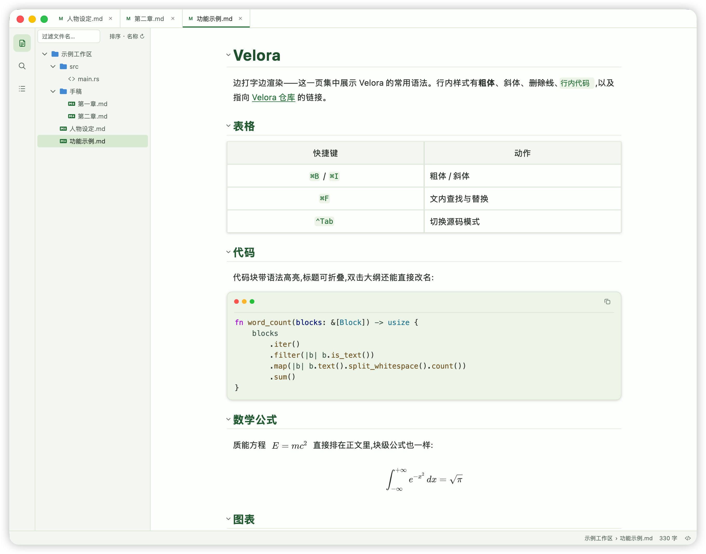
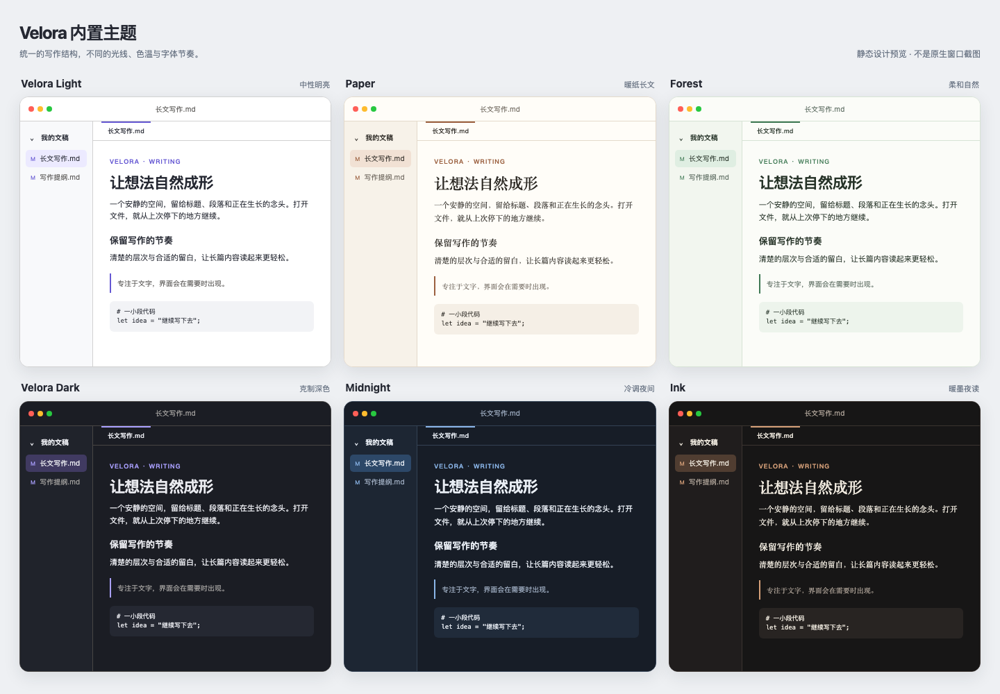

# Velora

**English** · [简体中文](README_CN.md)

---

Velora is a native Markdown editor built on Rust and GPUI: no Electron, no WebView, with the interface rendered directly on the GPU — faster startup, lower overhead, steadier response. WYSIWYG by default, switchable to Markdown source at any time. Beyond raw performance, the interface stays modern, clean and readable — light and fluid.

## Screenshots





## ✨ Features

### Writing & editing

- **WYSIWYG + source modes** — Markdown renders as you type; switch to raw source at any time, and undo history survives mode switches.
- **A full block set** — headings, ordered/bulleted/task lists, tables, code blocks, quotes, footnotes, callouts, horizontal rules and images; inline bold/italic, inline code, links and strikethrough.
- **Math & diagrams in place** — LaTeX formulas and Mermaid diagrams render directly inside the document.
- **Images** — paste or drag one in and it is copied into the document's assets folder with a relative link; drag the resize handle and the width is written back as `{width=NN%}`.
- **Editing conveniences** — lists continue on `Enter`; typing a paired character wraps the selection; pasting a URL over a selection creates a link; HTML copied from a browser or Word is converted to Markdown on paste.
- **Smart punctuation** (off by default, one switch in Settings) — context-aware curly quotes and `--` → em dash.
- **VS Code–style find & replace** — powered by ripgrep's engine, in-process: case, whole-word, regex (multi-line patterns included) and fuzzy matching; every match is highlighted while the panel is open, and the result list, highlighting, jumping and replace-all read the same match table.
- **Syntax highlighting** — Rust, JavaScript/TypeScript, C/C++, C#, Go, Java, PHP, Python, Ruby, HTML/CSS, JSON, YAML, TOML and Bash; other text files open and edit as plain text.

### Workspace & knowledge

- **Folder = workspace** — the file tree supports new / rename / duplicate / copy-paste / delete (to the system Trash), sorting by name, modification time or type, a filter box for quick lookup, and hover tooltips with size and mtime.
- **Global search** matches file names *and* contents, with workspace-wide replace; file bodies are decoded the same way documents are (UTF-8 first, GB18030 fallback).
- **Outline pane** — click to jump, follows scrolling to highlight the current section, double-click or `F2` renames the heading in the body.
- **Knowledge links** — `[[wikilinks]]` open or create the note; `#tags` jump into a workspace search; `[TOC]` renders as a clickable table of contents.
- **Frontmatter & structure** — YAML frontmatter is preserved verbatim; headings fold; links and footnote references show hover previews.
- **Links that behave** — `Cmd/Ctrl+click` goes straight to the target: external URLs to the browser, local files in-app, `#anchors` within the document.
- **External changes** — a clean tab reloads automatically when its file changes on disk; edited tabs get a conflict prompt instead of a silent overwrite.

### Navigation & windows

- **⌘P quick switcher** with IME-friendly input, **⇧⌘P command palette** covering every command.
- **Tabs merged into the title bar** — drag to reorder, `⌘1–9` to jump, middle-click to close, right-click for bulk close.
- **Cursor history** — `⌥⌘←` / `⌥⌘→` walk back and forward across files.
- **Session & windows** — welcome page for empty workspaces, previous session's tabs restored on launch, window size and position remembered, `⌘+` / `⌘−` / `⌘0` zoom, fullscreen toggle.
- **Status bar** — word and selection counts, estimated reading time, clickable breadcrumb path.

### Reliability & performance

- **Your text survives** — autosave with a configurable debounce, atomic writes (temp file + rename), and automatic recovery of unsaved content after a crash.
- **Big documents stay fast** — huge manuscripts build their first screen synchronously while the rest streams in through background chunks; typing and scrolling never stall.
- **Fast startup** — initialization is spread across frames, so the window appears without delay.
- **Guarded by tests** — 1000+ automated tests, golden snapshots of rendered block structure, and a per-block import budget that fails CI on regression.

### Export

- **Formats** — single-file HTML with images embedded as data URIs, PDF, full-height PNG capture, system printing, and copy-as-HTML.
- **Export theme** — pick *current*, *light* or *dark* for anything you export.
- **Chromium requirement** — PDF, printing and PNG rendering go through a headless Chromium. Have Chrome, Chromium or Edge installed, or point the `CHROME` environment variable at a browser binary.

### Look & feel

- **Six built-in themes** — Velora Light / Dark, Paper, Forest, Midnight and Ink — plus automatic switching with the system appearance; custom theme packs load from the user directory.
- **Focus & typewriter modes**, adjustable body/code fonts and sizes, and a configurable writing measure.
- **Bilingual UI** — Simplified Chinese and English built in; external language packs load by dropping them into the user directory.
- **In-app preferences** — one window for files, themes, images, shortcuts, window and status-bar options.

## ⌨️ Keyboard shortcuts

macOS keys shown; Ctrl-based equivalents work on other platforms. Shortcuts are customizable in Settings → Shortcuts.

| Keys | Action |
| --- | --- |
| `⌘P` | Quick file switcher |
| `⇧⌘P` | Command palette |
| `⌘F` | Find & replace (`⌘G` next match, `⇧⌘G` previous) |
| `⌃Tab` | Toggle WYSIWYG / source mode |
| `⌘B` / `⌘I` / `⌘U` / `` ⌘` `` | Bold / italic / underline / inline code |
| `⌘S` / `⇧⌘S` | Save / save as |
| `⇧⌘C` | Copy selection or document as HTML |
| `⌥⌘P` | Print |
| `⌘1`–`⌘9` | Switch to tab N |
| `⌥⌘←` / `⌥⌘→` | Cursor history: back / forward |
| `⌘+` / `⌘−` / `⌘0` | Zoom in / out / reset |
| `⌃⌘F` / `F11` | Toggle fullscreen |
| `⌃W` | Toggle sidebar |
| `⌘N` / `⌘O` | New window / open file |

## 🚀 Building from source

Requires **Rust 1.88 or newer**.

The repository's `.cargo/config.toml` wires `sccache` in as the compiler cache wrapper, so make sure it is installed first:

```bash
cargo install --locked sccache --version 0.17.0
```

Then:

```bash
cargo build
cargo run                       # launch with an empty window
cargo run /path/to/workspace    # open a folder as a workspace
cargo test
```

## 📦 Release packages

- **macOS** — run `scripts/package-macos.sh` to produce `dist/velora.app` and `dist/velora-0.1.0.pkg`. The package is unsigned and unnotarized, intended for local and small-scale internal use.
- **Windows** — `scripts/package-windows.sh` cross-builds an x64 installer from macOS (needs MinGW-w64 and NSIS) and produces `dist/velora-0.1.0-windows-x64-setup.exe`. On-device Windows validation is scheduled for the next release.

## ⚙️ Configuration

Configuration lives in the OS app-config directory (`~/Library/Application Support/velora/` on macOS):

| File / folder | Purpose |
| --- | --- |
| `config.toml` | Preferences — most entries are editable in the preferences window |
| `session.json` | Per-workspace open tabs, active tab and sidebar width |
| `languages/` | External language packs |
| `themes/` | External theme packs |

The main `config.toml` sections:

| Section | Keys | Controls |
| --- | --- | --- |
| `[window]` | `default_window_width`, `default_window_height`, `open_position`, `remember_bounds`, `zoom_percent` | Default size, centered vs. remembered opening position, window memory, UI zoom |
| `[editor]` | `tree_sort`, `autosave_debounce_ms`, `new_file_template`, `smart_punctuation`, `external_change_policy`, `delete_policy`, `workspace_sidebar_width` | File-tree sort, autosave interval, new-file template (`{date}` expands), smart punctuation, external-change handling, Trash vs. permanent delete, sidebar width |
| `[export]` | `theme` | `current` / `light` / `dark` for exported HTML, PDF and PNG |

## 📄 License

[Apache-2.0](LICENSE-APACHE)