# Mermaid 综合视觉验收

在 Velora 和 Typora 中打开同一份文件，逐项比较节点层级、连线走向、中文换行、内容完整性、间距与缩放。每节是一张独立图表，附有对应检查点。

[TOC]

## 01. 订单流程：嵌套子图与异常回退

检查判断节点的出线方向、长标签换行，以及退款、库存与支付回调之间的返回线。子图边界不应压住节点或标签。

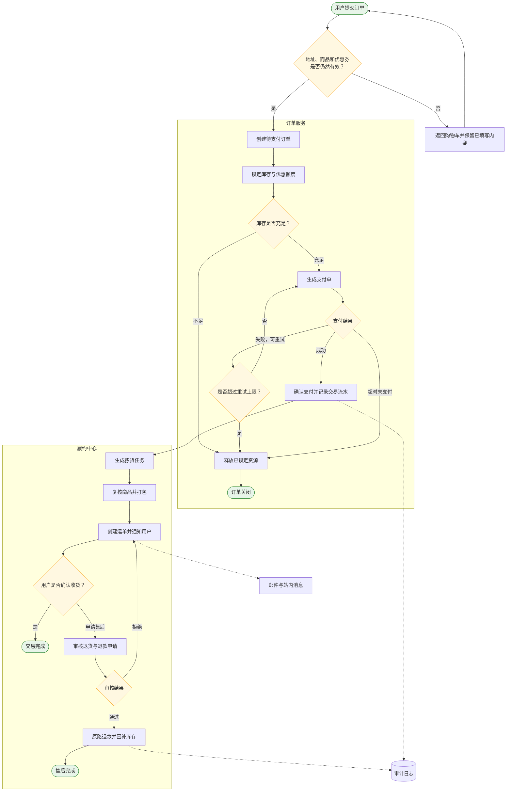
```mermaid
flowchart TD
    START([用户提交订单]) --> CHECK{"地址、商品和优惠券<br/>是否仍然有效？"}
    CHECK -->|否| EDIT[返回购物车并保留已填写内容]
    EDIT --> START
    CHECK -->|是| CREATE

    subgraph SERVICE[订单服务]
        CREATE[创建待支付订单] --> LOCK[锁定库存与优惠额度]
        LOCK --> STOCK{库存是否充足？}
        STOCK -->|不足| RELEASE[释放已锁定资源]
        RELEASE --> CLOSED([订单关闭])
        STOCK -->|充足| PAY[生成支付单]
        PAY --> RESULT{支付结果}
        RESULT -->|失败，可重试| RETRY{是否超过重试上限？}
        RETRY -->|否| PAY
        RETRY -->|是| RELEASE
        RESULT -->|超时未支付| RELEASE
        RESULT -->|成功| PAID[确认支付并记录交易流水]
    end

    subgraph FULFILLMENT[履约中心]
        direction TB
        PAID --> PICK[生成拣货任务]
        PICK --> PACKAGE[复核商品并打包]
        PACKAGE --> SHIP[创建运单并通知用户]
        SHIP --> RECEIVED{用户是否确认收货？}
        RECEIVED -->|是| DONE([交易完成])
        RECEIVED -->|申请售后| AFTERSALE[审核退货与退款申请]
        AFTERSALE --> APPROVE{审核结果}
        APPROVE -->|通过| REFUND[原路退款并回补库存]
        APPROVE -->|拒绝| SHIP
        REFUND --> REFUNDED([售后完成])
    end

    PAID -.-> AUDIT[(审计日志)]
    REFUND -.-> AUDIT
    SHIP -.-> MESSAGE[邮件与站内消息]
    classDef terminal fill:#e8f5e9,stroke:#388e3c
    classDef decision fill:#fff8e1,stroke:#f9a825
    class START,DONE,CLOSED,REFUNDED terminal
    class CHECK,STOCK,RESULT,RETRY,RECEIVED,APPROVE decision
```

## 02. 持续交付：横向布局与并行汇合

检查从左到右的主干、三个并行检查分支的汇合，以及灰度失败后返回构建阶段的长回线。

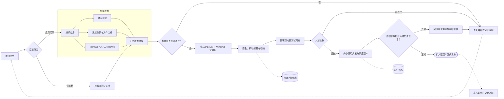
```mermaid
flowchart LR
    PUSH[推送提交] --> CHANGE{变更范围}
    CHANGE -->|应用代码| BUILD[编译应用]
    CHANGE -->|仅文档| DOCS[校验文档与链接]
    DOCS --> SUMMARY[汇总检查结果]

    subgraph CHECKS[质量检查]
        direction TB
        BUILD --> UNIT[单元测试]
        BUILD --> INTEGRATION[集成测试与文件往返]
        BUILD --> VISUAL[Mermaid 与公式视觉回归]
        UNIT --> SUMMARY
        INTEGRATION --> SUMMARY
        VISUAL --> SUMMARY
    end

    SUMMARY --> PASS{检查是否全部通过？}
    PASS -->|否| FIX[修复并补充回归用例]
    FIX -.-> PUSH
    PASS -->|是| PACKAGE[生成 macOS 与 Windows 安装包]
    PACKAGE --> SIGN[签名、校验摘要与归档]
    SIGN --> STAGING[部署到内部测试渠道]
    STAGING --> ACCEPT{人工验收}
    ACCEPT -->|未通过| FIX
    ACCEPT -->|通过| CANARY[向少量用户发布灰度版本]
    CANARY --> HEALTH{崩溃率与打开耗时是否正常？}
    HEALTH -->|异常| ROLLBACK[回滚渠道并保存诊断数据]
    ROLLBACK --> FIX
    HEALTH -->|正常| RELEASE([扩大范围并正式发布])
    SIGN -.-> ARTIFACT[(构建产物仓库)]
    CANARY -.-> METRICS[(运行指标)]
    RELEASE -.-> NOTES[发布说明与更新通知]
```

## 03. 数据处理流水线：多分支汇合与失败恢复

检查调度器自环、三条处理分支的汇合，以及自动重试和人工修正两条返回路径。长中文标签应正常换行，返回线不能穿过节点或遮住标签。

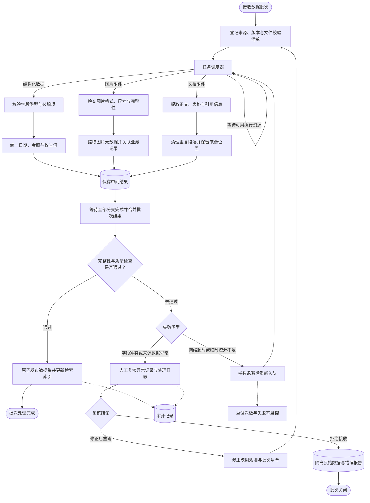
```mermaid
flowchart TD
    START([接收数据批次]) --> MANIFEST[登记来源、版本与文件校验清单]
    MANIFEST --> DISPATCH[任务调度器]
    DISPATCH -->|"等待可用执行资源"| DISPATCH

    DISPATCH -->|"结构化数据"| SCHEMA[校验字段类型与必填项]
    DISPATCH -->|"图片附件"| IMAGE[检查图片格式、尺寸与完整性]
    DISPATCH -->|"文档附件"| DOCUMENT[提取正文、表格与引用信息]
    SCHEMA --> NORMALIZE[统一日期、金额与枚举值]
    IMAGE --> METADATA[提取图片元数据并关联业务记录]
    DOCUMENT --> EXTRACT[清理重复段落并保留来源位置]

    NORMALIZE --> STAGE[(保存中间结果)]
    METADATA --> STAGE
    EXTRACT --> STAGE
    STAGE --> MERGE[等待全部分支完成并合并批次结果]
    MERGE --> QUALITY{"完整性与质量检查<br/>是否通过？"}

    QUALITY -->|通过| PUBLISH[原子发布数据集并更新检索索引]
    PUBLISH --> DONE([批次处理完成])
    QUALITY -->|未通过| FAILURE{失败类型}
    FAILURE -->|网络超时或临时资源不足| RETRY[指数退避后重新入队]
    RETRY --> DISPATCH
    FAILURE -->|字段冲突或来源数据异常| REVIEW[人工复核异常记录与处理日志]
    REVIEW --> DECISION{复核结论}
    DECISION -->|修正后重跑| CORRECT[修正映射规则与批次清单]
    CORRECT --> MANIFEST
    DECISION -->|拒绝接收| QUARANTINE[(隔离原始数据与错误报告)]
    QUARANTINE --> CLOSED([批次关闭])

    PUBLISH -.-> AUDIT[(审计记录)]
    REVIEW -.-> AUDIT
    RETRY -.-> METRICS[重试次数与失败率监控]
```

## 04. 下单时序：并发、重试与条件分支

检查中文参与者名、激活条、嵌套分支与并发区域。长消息和跨参与者注释应完整显示。

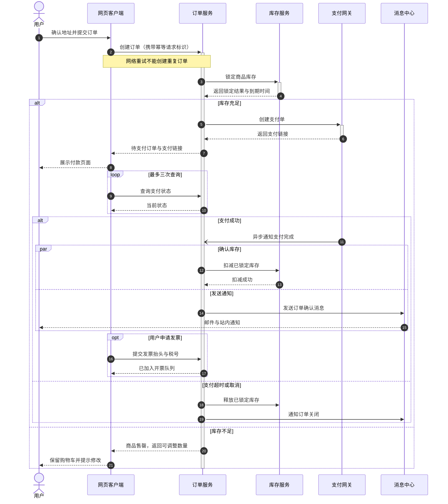
```mermaid
sequenceDiagram
    autonumber
    actor User as 用户
    participant Web as 网页客户端
    participant Order as 订单服务
    participant Stock as 库存服务
    participant Pay as 支付网关
    participant Message as 消息中心

    User->>Web: 确认地址并提交订单
    Web->>+Order: 创建订单（携带幂等请求标识）
    Note over Web,Order: 网络重试不能创建重复订单
    Order->>+Stock: 锁定商品库存
    Stock-->>-Order: 返回锁定结果与到期时间
    alt 库存充足
        Order->>+Pay: 创建支付单
        Pay-->>-Order: 返回支付链接
        Order-->>Web: 待支付订单与支付链接
        Web-->>User: 展示付款页面
        loop 最多三次查询
            Web->>Order: 查询支付状态
            Order-->>Web: 当前状态
        end
        alt 支付成功
            Pay-)Order: 异步通知支付完成
            par 确认库存
                Order->>Stock: 扣减已锁定库存
                Stock-->>Order: 扣减成功
            and 发送通知
                Order->>Message: 发送订单确认消息
                Message-->>User: 邮件与站内通知
            end
            opt 用户申请发票
                Web->>Order: 提交发票抬头与税号
                Order-->>Web: 已加入开票队列
            end
        else 支付超时或取消
            Order->>Stock: 释放已锁定库存
            Order->>Message: 通知订单关闭
        end
    else 库存不足
        Order-->>Web: 商品售罄，返回可调整数量
        Web-->>User: 保留购物车并提示修改
    end
    deactivate Order
```

## 05. 领域模型：接口、组合与多重关系

检查方法签名、泛型、多重关系和接口标记。连线不应穿过类名、属性或方法区域。

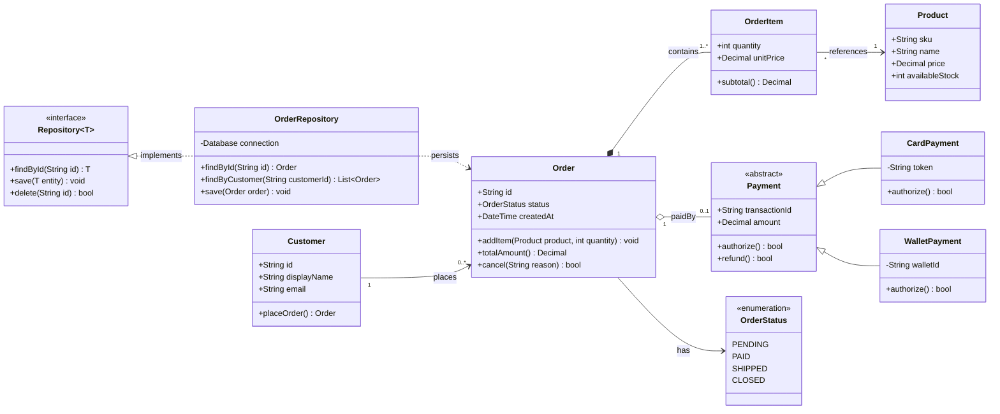
```mermaid
classDiagram
    direction LR
    class Repository~T~ {
        <<interface>>
        +findById(String id) T
        +save(T entity) void
        +delete(String id) bool
    }
    class OrderRepository {
        -Database connection
        +findById(String id) Order
        +findByCustomer(String customerId) List~Order~
        +save(Order order) void
    }
    class Customer {
        +String id
        +String displayName
        +String email
        +placeOrder() Order
    }
    class Order {
        +String id
        +OrderStatus status
        +DateTime createdAt
        +addItem(Product product, int quantity) void
        +totalAmount() Decimal
        +cancel(String reason) bool
    }
    class OrderItem {
        +int quantity
        +Decimal unitPrice
        +subtotal() Decimal
    }
    class Product {
        +String sku
        +String name
        +Decimal price
        +int availableStock
    }
    class Payment {
        <<abstract>>
        +String transactionId
        +Decimal amount
        +authorize() bool
        +refund() bool
    }
    class CardPayment {
        -String token
        +authorize() bool
    }
    class WalletPayment {
        -String walletId
        +authorize() bool
    }
    class OrderStatus {
        <<enumeration>>
        PENDING
        PAID
        SHIPPED
        CLOSED
    }
    Repository~T~ <|.. OrderRepository : implements
    OrderRepository ..> Order : persists
    Customer "1" --> "0..*" Order : places
    Order "1" *-- "1..*" OrderItem : contains
    OrderItem "*" --> "1" Product : references
    Order "1" o-- "0..1" Payment : paidBy
    Payment <|-- CardPayment
    Payment <|-- WalletPayment
    Order --> OrderStatus : has
```

## 06. 订单状态机：复合状态与重试

检查复合状态边界、选择节点、取消路径与支付重试回线。终态应和普通节点区分。

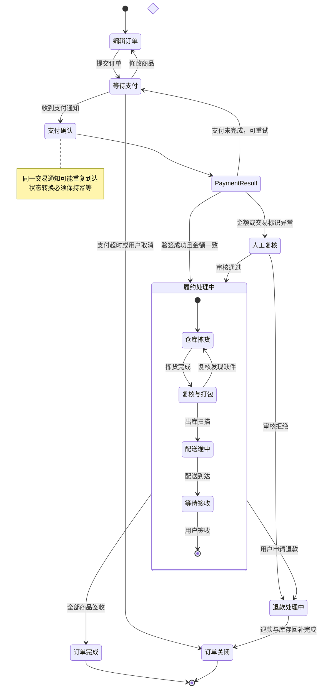
```mermaid
stateDiagram-v2
    direction TB
    [*] --> Draft
    state "编辑订单" as Draft
    state "等待支付" as Pending
    state "支付确认" as Confirming
    state "处理支付结果" as PaymentResult <<choice>>
    state "履约处理中" as Fulfillment {
        [*] --> Picking
        state "仓库拣货" as Picking
        state "复核与打包" as Packing
        state "配送途中" as Shipping
        state "等待签收" as Receiving
        Picking --> Packing : 拣货完成
        Packing --> Shipping : 出库扫描
        Shipping --> Receiving : 配送到达
        Receiving --> [*] : 用户签收
        Packing --> Picking : 复核发现缺件
    }
    state "人工复核" as Reviewing
    state "退款处理中" as Refunding
    state "订单完成" as Completed
    state "订单关闭" as Closed

    Draft --> Pending : 提交订单
    Pending --> Draft : 修改商品
    Pending --> Confirming : 收到支付通知
    Pending --> Closed : 支付超时或用户取消
    Confirming --> PaymentResult
    PaymentResult --> Fulfillment : 验签成功且金额一致
    PaymentResult --> Reviewing : 金额或交易标识异常
    PaymentResult --> Pending : 支付未完成，可重试
    Reviewing --> Fulfillment : 审核通过
    Reviewing --> Refunding : 审核拒绝
    Fulfillment --> Completed : 全部商品签收
    Fulfillment --> Refunding : 用户申请退款
    Refunding --> Closed : 退款与库存回补完成
    Completed --> [*]
    Closed --> [*]
    note right of Confirming
        同一交易通知可能重复到达
        状态转换必须保持幂等
    end note
```

## 07. 电商数据模型：实体、字段与关系基数

检查字段类型、主外键标记、中文注释和关系基数。多条关系不应覆盖字段列表。

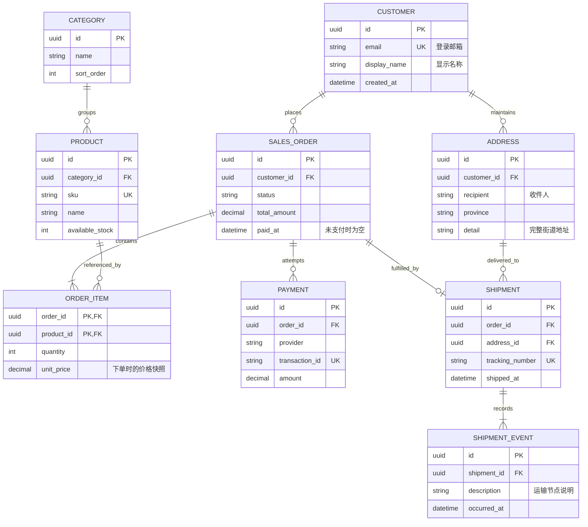
```mermaid
erDiagram
    CUSTOMER ||--o{ ADDRESS : maintains
    CUSTOMER ||--o{ SALES_ORDER : places
    SALES_ORDER ||--|{ ORDER_ITEM : contains
    PRODUCT ||--o{ ORDER_ITEM : referenced_by
    CATEGORY ||--o{ PRODUCT : groups
    SALES_ORDER ||--o{ PAYMENT : attempts
    SALES_ORDER ||--o| SHIPMENT : fulfilled_by
    ADDRESS ||--o{ SHIPMENT : delivered_to
    SHIPMENT ||--|{ SHIPMENT_EVENT : records

    CUSTOMER {
        uuid id PK
        string email UK "登录邮箱"
        string display_name "显示名称"
        datetime created_at
    }
    ADDRESS {
        uuid id PK
        uuid customer_id FK
        string recipient "收件人"
        string province
        string detail "完整街道地址"
    }
    SALES_ORDER {
        uuid id PK
        uuid customer_id FK
        string status
        decimal total_amount
        datetime paid_at "未支付时为空"
    }
    ORDER_ITEM {
        uuid order_id PK, FK
        uuid product_id PK, FK
        int quantity
        decimal unit_price "下单时的价格快照"
    }
    PRODUCT {
        uuid id PK
        uuid category_id FK
        string sku UK
        string name
        int available_stock
    }
    CATEGORY {
        uuid id PK
        string name
        int sort_order
    }
    PAYMENT {
        uuid id PK
        uuid order_id FK
        string provider
        string transaction_id UK
        decimal amount
    }
    SHIPMENT {
        uuid id PK
        uuid order_id FK
        uuid address_id FK
        string tracking_number UK
        datetime shipped_at
    }
    SHIPMENT_EVENT {
        uuid id PK
        uuid shipment_id FK
        string description "运输节点说明"
        datetime occurred_at
    }
```

## 08. 发布计划：依赖、关键路径与里程碑

检查日期刻度、任务名称、分组、完成状态和依赖链。右侧长任务名称与最后一个里程碑都应完整显示。

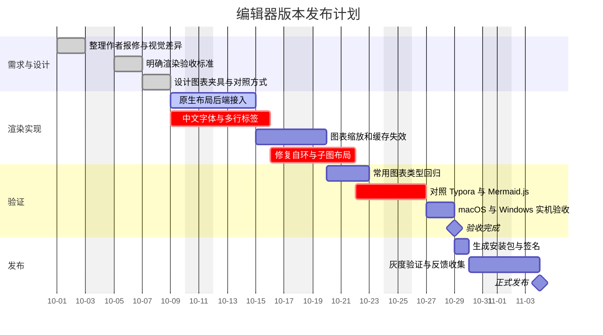
```mermaid
gantt
    title 编辑器版本发布计划
    dateFormat YYYY-MM-DD
    axisFormat %m-%d
    excludes weekends
    todayMarker off

    section 需求与设计
    整理作者报修与视觉差异       :done, requirements, 2026-10-01, 2d
    明确渲染验收标准             :done, acceptance, after requirements, 2d
    设计图表夹具与对照方式       :done, fixtures, after acceptance, 2d

    section 渲染实现
    原生布局后端接入             :active, backend, after fixtures, 4d
    中文字体与多行标签           :crit, typography, after fixtures, 5d
    图表缩放和缓存失效           :cache, after backend, 3d
    修复自环与子图布局           :crit, routing, after typography, 4d

    section 验证
    常用图表类型回归             :regression, after cache, 3d
    对照 Typora 与 Mermaid.js    :crit, visual, after routing, 3d
    macOS 与 Windows 实机验收    :platforms, after visual, 2d
    验收完成                     :milestone, approved, after platforms, 0d

    section 发布
    生成安装包与签名             :package, after approved, 1d
    灰度验证与反馈收集           :canary, after package, 3d
    正式发布                     :milestone, release, after canary, 0d
```

## 09. 用户旅程：从导入文档到分享

检查多角色图例、阶段背景、评分表情和长中文任务名。不同阶段的任务应保持可读的间距。

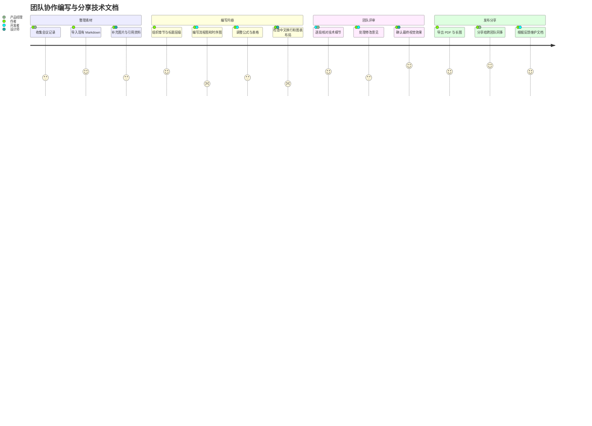
```mermaid
journey
    title 团队协作编写与分享技术文档
    section 整理素材
      收集会议记录: 3: 作者, 产品经理
      导入现有 Markdown: 4: 作者
      补充图片与引用资料: 3: 作者, 设计师
    section 编写内容
      组织章节与标题层级: 4: 作者
      编写流程图和时序图: 2: 作者, 开发者
      调整公式与表格: 3: 作者, 开发者
      检查中文换行和图表布局: 2: 作者, 设计师
    section 团队评审
      逐段核对技术细节: 4: 开发者, 产品经理
      处理修改意见: 3: 作者, 开发者
      确认最终视觉效果: 5: 作者, 设计师
    section 发布分享
      导出 PDF 与长图: 4: 作者
      分享给跨团队同事: 5: 作者, 产品经理
      根据反馈维护文档: 4: 作者, 开发者
```

## 10. 思维导图：多层编辑器功能地图

检查中心节点、多层分支、中文长标签和不同节点形状。左右分支应均衡展开，文字不能被边界裁切。

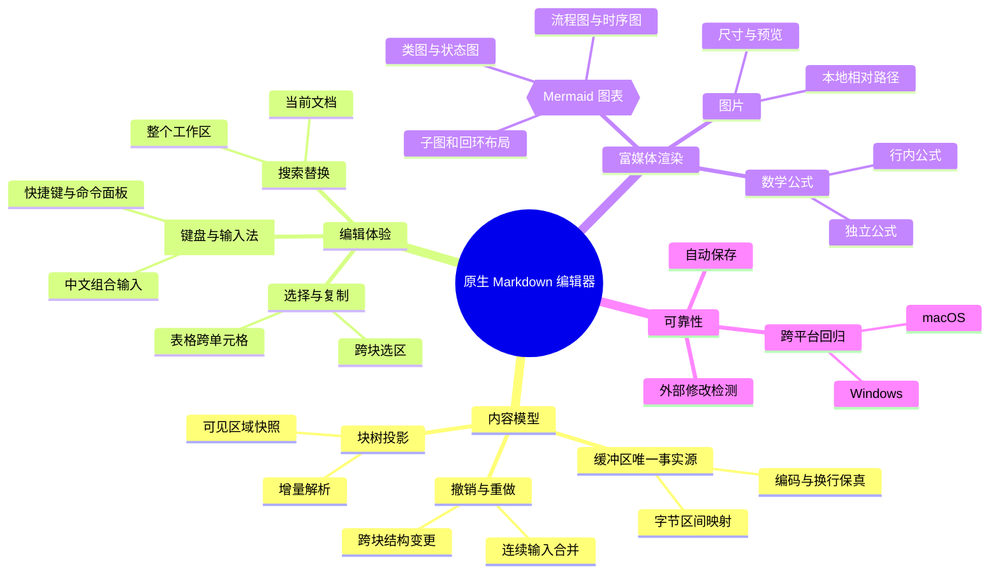
```mermaid
mindmap
  root((原生 Markdown 编辑器))
    内容模型
      缓冲区唯一事实源
        字节区间映射
        编码与换行保真
      块树投影
        增量解析
        可见区域快照
      撤销与重做
        连续输入合并
        跨块结构变更
    编辑体验
      [键盘与输入法]
        中文组合输入
        快捷键与命令面板
      选择与复制
        跨块选区
        表格跨单元格
      搜索替换
        当前文档
        整个工作区
    富媒体渲染
      {{Mermaid 图表}}
        流程图与时序图
        类图与状态图
        子图和回环布局
      数学公式
        行内公式
        独立公式
      图片
        本地相对路径
        尺寸与预览
    可靠性
      自动保存
      外部修改检测
      跨平台回归
        macOS
        Windows
```

## 11. Git 历史：功能分支、热修复与发布

检查分支线、汇合点、提交标记和版本标签。多个合并不能重叠成一条无法分辨的线。

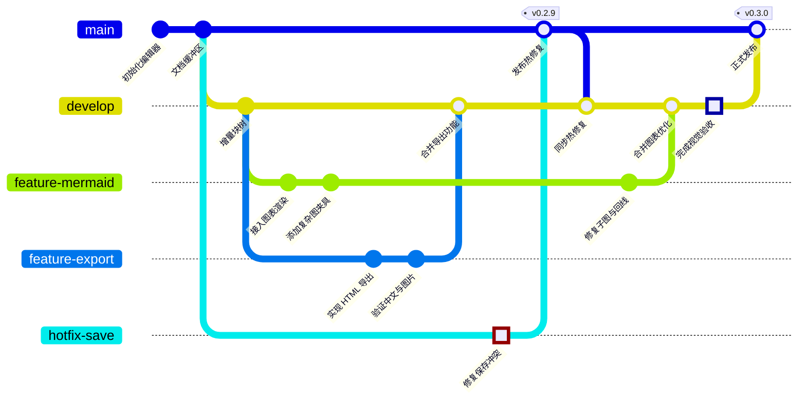
```mermaid
gitGraph
    commit id: "初始化编辑器"
    commit id: "文档缓冲区"
    branch develop
    checkout develop
    commit id: "增量块树"
    branch feature-mermaid
    checkout feature-mermaid
    commit id: "接入图表渲染"
    commit id: "添加复杂图夹具"
    checkout develop
    branch feature-export
    checkout feature-export
    commit id: "实现 HTML 导出"
    commit id: "验证中文与图片"
    checkout develop
    merge feature-export id: "合并导出功能"
    checkout main
    branch hotfix-save
    checkout hotfix-save
    commit id: "修复保存冲突" type: HIGHLIGHT
    checkout main
    merge hotfix-save id: "发布热修复" tag: "v0.2.9"
    checkout develop
    merge main id: "同步热修复"
    checkout feature-mermaid
    commit id: "修复子图与回线"
    checkout develop
    merge feature-mermaid id: "合并图表优化"
    commit id: "完成视觉验收" type: HIGHLIGHT
    checkout main
    merge develop id: "正式发布" tag: "v0.3.0"
```

## 12. 饼图：多分类请求来源

检查中文图例、百分比、标题与较小扇区的标记。图例应能完整放下最长分类名称。

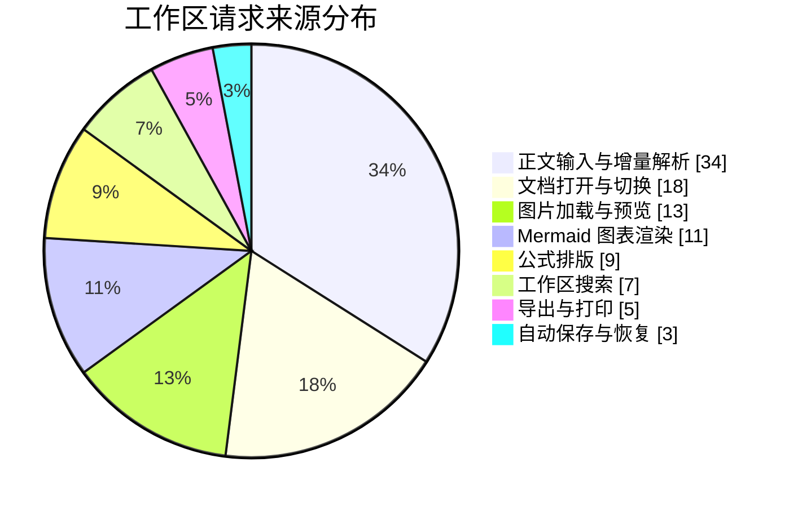
```mermaid
pie showData
    title 工作区请求来源分布
    "正文输入与增量解析" : 34
    "文档打开与切换" : 18
    "图片加载与预览" : 13
    "Mermaid 图表渲染" : 11
    "公式排版" : 9
    "工作区搜索" : 7
    "导出与打印" : 5
    "自动保存与恢复" : 3
```

## 13. 时间线：多阶段产品演进

检查阶段分组、同一时点的多项事件、长中文说明和横向排布。

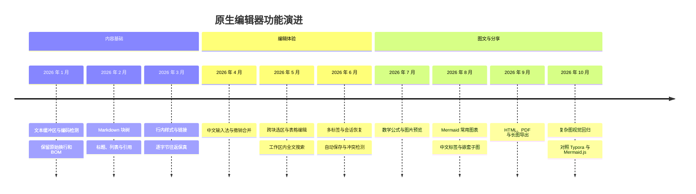
```mermaid
timeline
    title 原生编辑器功能演进
    section 内容基础
        2026 年 1 月 : 文本缓冲区与编码检测
                    : 保留原始换行和 BOM
        2026 年 2 月 : Markdown 块树
                    : 标题、列表与引用
        2026 年 3 月 : 行内样式与链接
                    : 逐字节往返保真
    section 编辑体验
        2026 年 4 月 : 中文输入法与撤销合并
        2026 年 5 月 : 跨块选区与表格编辑
                    : 工作区内全文搜索
        2026 年 6 月 : 多标签与会话恢复
                    : 自动保存与冲突检测
    section 图文与分享
        2026 年 7 月 : 数学公式与图片预览
        2026 年 8 月 : Mermaid 常用图表
                    : 中文标签与嵌套子图
        2026 年 9 月 : HTML、PDF 与长图导出
        2026 年 10 月 : 复杂图视觉回归
                     : 对照 Typora 与 Mermaid.js
```

## 14. 需求图：发布门禁与验证追踪

检查不同需求节点的字段、关系标签与连线方向。验证元素应能追踪到对应需求。

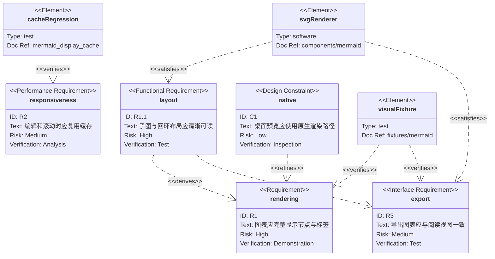
```mermaid
requirementDiagram
    requirement rendering {
        id: R1
        text: "图表应完整显示节点与标签"
        risk: high
        verifymethod: demonstration
    }
    functionalRequirement layout {
        id: R1.1
        text: "子图与回环布局应清晰可读"
        risk: high
        verifymethod: test
    }
    performanceRequirement responsiveness {
        id: R2
        text: "编辑和滚动时应复用缓存"
        risk: medium
        verifymethod: analysis
    }
    interfaceRequirement export {
        id: R3
        text: "导出图表应与阅读视图一致"
        risk: medium
        verifymethod: test
    }
    designConstraint native {
        id: C1
        text: "桌面预览应使用原生渲染路径"
        risk: low
        verifymethod: inspection
    }
    element visualFixture {
        type: "test"
        docRef: "fixtures/mermaid"
    }
    element cacheRegression {
        type: "test"
        docRef: "mermaid_display_cache"
    }
    element svgRenderer {
        type: "software"
        docRef: "components/mermaid"
    }
    layout - derives -> rendering
    native - refines -> rendering
    svgRenderer - satisfies -> layout
    svgRenderer - satisfies -> export
    visualFixture - verifies -> rendering
    visualFixture - verifies -> export
    cacheRegression - verifies -> responsiveness
    layout - traces -> export
```

## 15. 象限图：修复优先级矩阵

检查坐标轴、四个象限标题、密集点位和中文标签。靠近边缘的点名不能被裁切。

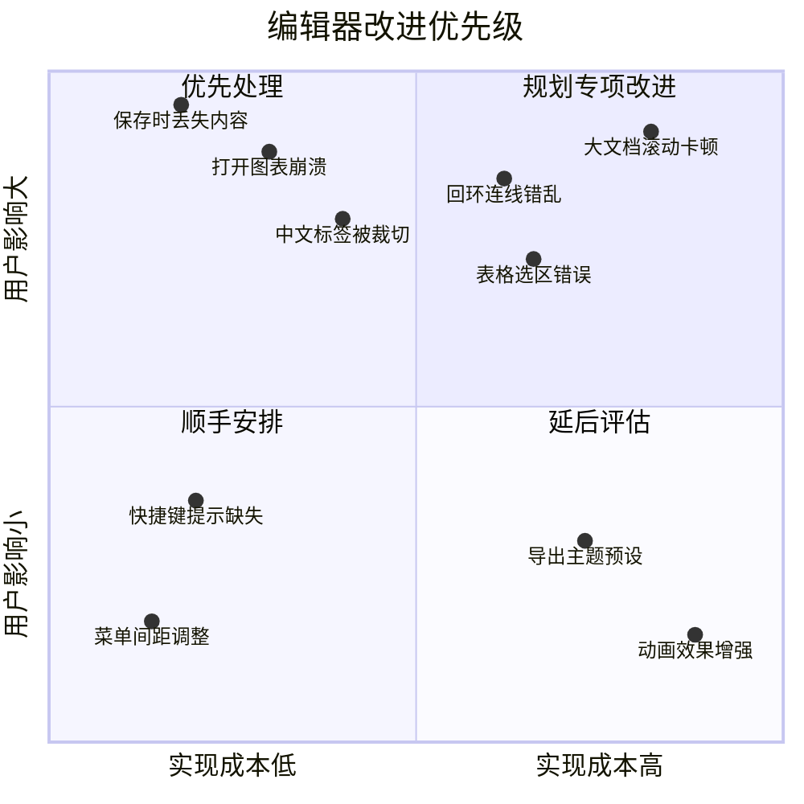
```mermaid
quadrantChart
    title 编辑器改进优先级
    x-axis "实现成本低" --> "实现成本高"
    y-axis "用户影响小" --> "用户影响大"
    quadrant-1 "规划专项改进"
    quadrant-2 "优先处理"
    quadrant-3 "顺手安排"
    quadrant-4 "延后评估"
    "保存时丢失内容": [0.18, 0.95]
    "打开图表崩溃": [0.30, 0.88]
    "回环连线错乱": [0.62, 0.84]
    "中文标签被裁切": [0.40, 0.78]
    "大文档滚动卡顿": [0.82, 0.91]
    "表格选区错误": [0.66, 0.72]
    "快捷键提示缺失": [0.20, 0.36]
    "菜单间距调整": [0.14, 0.18]
    "导出主题预设": [0.73, 0.30]
    "动画效果增强": [0.88, 0.16]
```

## 16. 坐标图：柱线组合与多条趋势

检查柱形和折线的叠加、坐标轴范围、中文标题和月份刻度。三组数据都应显示。

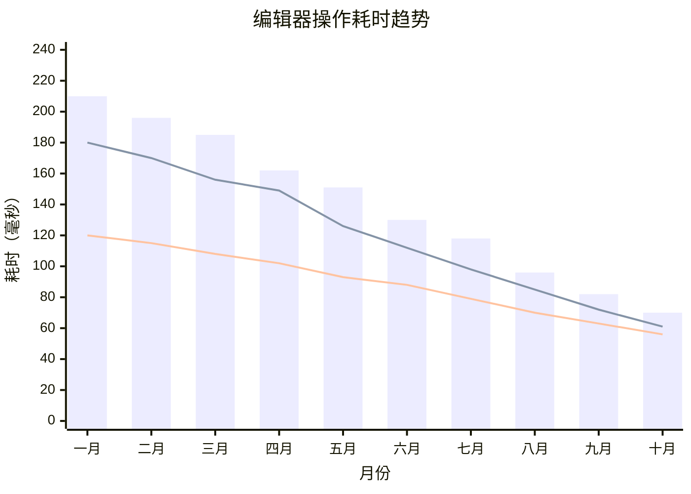
```mermaid
xychart-beta
    title "编辑器操作耗时趋势"
    x-axis "月份" ["一月", "二月", "三月", "四月", "五月", "六月", "七月", "八月", "九月", "十月"]
    y-axis "耗时（毫秒）" 0 --> 240
    bar [210, 196, 185, 162, 151, 130, 118, 96, 82, 70]
    line [180, 170, 156, 149, 126, 112, 98, 85, 72, 61]
    line [120, 115, 108, 102, 93, 88, 79, 70, 63, 56]
```

## 17. 桑基图：请求分流、缓存与重试

检查流量宽度、多层分流和交叉连线。节点名不能压在流带上无法辨认。本例采用英文 CSV 节点名，可直接交给 Mermaid.js 与 Typora 对照。

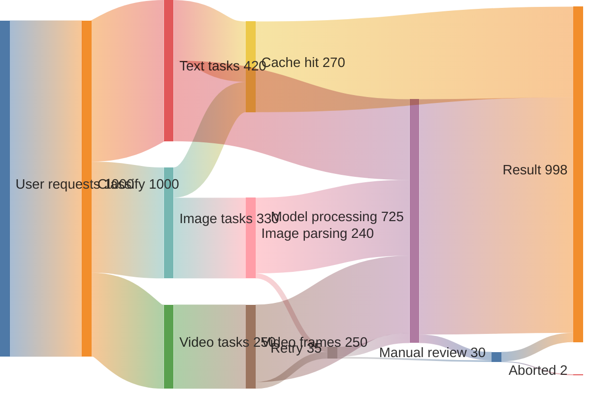
```mermaid
sankey-beta

"User requests","Classify",1000
"Classify","Text tasks",420
"Classify","Image tasks",330
"Classify","Video tasks",250
"Text tasks","Cache hit",180
"Text tasks","Model processing",240
"Image tasks","Cache hit",90
"Image tasks","Image parsing",240
"Video tasks","Video frames",250
"Image parsing","Model processing",225
"Image parsing","Retry",15
"Video frames","Model processing",230
"Video frames","Retry",20
"Retry","Model processing",30
"Retry","Manual review",5
"Cache hit","Result",270
"Model processing","Result",700
"Model processing","Manual review",25
"Manual review","Result",28
"Manual review","Aborted",2
```

## 18. 块图：分层组件与跨层依赖

检查嵌套块、跨列宽度、空白占位和跨层连线。内部组件不应挤出父块边界。

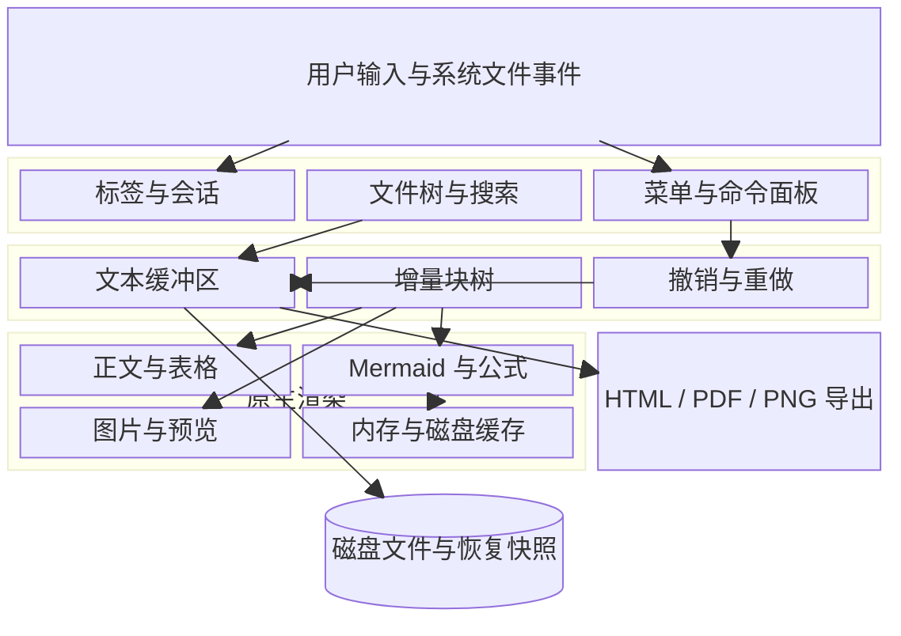
```mermaid
block-beta
    columns 3
    USER["用户输入与系统文件事件"]:3

    block:WORKSPACE["工作区界面"]:3
        columns 3
        TABS["标签与会话"]
        FILES["文件树与搜索"]
        COMMANDS["菜单与命令面板"]
    end

    block:EDITOR["编辑器核心"]:3
        columns 3
        BUFFER["文本缓冲区"]
        TREE["增量块树"]
        HISTORY["撤销与重做"]
    end

    block:RENDER["原生渲染"]:2
        columns 2
        TEXT["正文与表格"]
        DIAGRAM["Mermaid 与公式"]
        IMAGE["图片与预览"]
        CACHE["内存与磁盘缓存"]
    end
    EXPORT["HTML / PDF / PNG 导出"]

    DISK[("磁盘文件与恢复快照")]:3
    USER --> TABS
    USER --> COMMANDS
    FILES --> BUFFER
    COMMANDS --> HISTORY
    BUFFER --> TREE
    HISTORY --> BUFFER
    TREE --> TEXT
    TREE --> DIAGRAM
    TREE --> IMAGE
    DIAGRAM --> CACHE
    BUFFER --> EXPORT
    BUFFER --> DISK
```
